# Design Document

## Overview

The AI Goal Planning feature transforms the current manual goal creation process into an intelligent, conversational experience powered by Google's Agent Development Kit (ADK). Instead of users filling out complex SMART criteria forms, they simply describe their goal in natural language, and specialized AI agents automatically generate a comprehensive, structured plan with all necessary components.

This feature integrates with the existing goal management system, leveraging the current SMARTGoal model, GoalService, and SMARTGoalEngine while adding new AI-powered agent components built on ADK for natural language processing, plan generation, and multi-agent orchestration.

### Why Google's Agent Development Kit?

- **Multi-Agent Architecture**: Perfect for our specialized agents (NLP, SMART generation, conversation management)
- **Flexible Orchestration**: Sequential and parallel workflows for goal planning pipeline
- **Model-Agnostic**: Supports multiple AI models with easy switching
- **Rich Tool Ecosystem**: Built-in tools and custom function integration
- **Deployment Ready**: Easy containerization and scaling options
- **Built-in Evaluation**: Systematic assessment of agent performance

## Architecture

### High-Level Architecture with ADK

```mermaid
graph TB
    A[User Input] --> B[ADK Orchestrator Agent]
    A --> AA[Model Selector UI]
    
    B --> C[NLP Agent]
    B --> D[SMART Generator Agent]
    B --> E[Conversation Agent]
    B --> F[Validation Agent]
    
    AA --> BB[ADK Model Manager]
    BB --> CC[Gemini Models]
    BB --> DD[OpenAI Models]
    BB --> EE[Anthropic Models]
    BB --> FF[Local Models]
    
    C --> G[Intent Extraction Tool]
    C --> H[Context Analysis Tool]
    C --> I[Timeline Parsing Tool]
    
    D --> J[Specific Generator Tool]
    D --> K[Measurable Generator Tool]
    D --> L[Achievable Generator Tool]
    D --> M[Relevant Generator Tool]
    D --> N[Time-bound Generator Tool]
    
    E --> O[Conversation Management Tool]
    E --> P[Feedback Processing Tool]
    
    F --> Q[SMART Validation Tool]
    F --> R[Quality Assessment Tool]
    
    B --> S[Sequential Workflow Agent]
    S --> T[Parallel Processing Agent]
    
    B --> U[Existing SMARTGoalEngine]
    B --> V[Existing GoalService]
    
    U --> W[Goal Storage]
```



### Component Integration

The AI Goal Planning feature integrates seamlessly with existing components:

- **SMARTGoalModel**: Unchanged, continues to represent structured goals
- **SMARTGoalEngine**: Enhanced with AI-generated input validation
- **GoalService**: Extended with AI planning methods
- **GoalForm**: New AI-powered alternative interface
- **GoalManager**: Unchanged, manages AI-generated goals identically

## Components and Interfaces

### 1. ADK Orchestrator Agent (Core Service)

```typescript
import { Agent, SequentialAgent, ParallelAgent, LlmAgent } from '@google/adk';

interface GoalPlanningOrchestrator extends Agent {
  generateGoalFromDescription(description: string, userId: string): Promise<AIGoalPlan>;
  refineGoalPlan(planId: string, feedback: string): Promise<AIGoalPlan>;
  convertToSMARTGoal(plan: AIGoalPlan): Promise<SMARTGoal>;
  setAIModel(modelId: string): Promise<void>;
  getCurrentModel(): AIModelInfo;
}

class GoalPlanningOrchestratorAgent extends SequentialAgent implements GoalPlanningOrchestrator {
  private nlpAgent: NLPAgent;
  private smartAgent: SMARTGeneratorAgent;
  private conversationAgent: ConversationAgent;
  private validationAgent: ValidationAgent;
  
  constructor() {
    super({
      name: 'goal-planning-orchestrator',
      description: 'Orchestrates the AI goal planning process using multiple specialized agents',
      agents: [
        new NLPAgent(),
        new ParallelAgent({
          name: 'smart-generation-parallel',
          agents: [
            new SMARTGeneratorAgent(),
            new ValidationAgent()
          ]
        }),
        new ConversationAgent()
      ]
    });
  }
}

interface AIGoalPlan {
  id: string;
  userId: string;
  originalDescription: string;
  extractedIntent: GoalIntent;
  generatedSMART: GeneratedSMARTCriteria;
  confidence: number;
  suggestions: string[];
  modelUsed: string;
  agentTrace: AgentExecutionTrace;
  createdAt: Date;
  updatedAt: Date;
}

interface AgentExecutionTrace {
  orchestratorId: string;
  agentCalls: AgentCall[];
  totalExecutionTime: number;
  parallelExecutions: number;
}

interface AgentCall {
  agentName: string;
  startTime: Date;
  endTime: Date;
  input: any;
  output: any;
  success: boolean;
  error?: string;
}
```

### 2. ADK Model Management

```typescript
import { Model, GeminiModel, OpenAIModel, AnthropicModel } from '@google/adk';

interface ADKModelManager {
  getAvailableModels(): Promise<AIModelInfo[]>;
  getCurrentModel(): Model;
  setCurrentModel(modelId: string): Promise<void>;
  createModelInstance(modelId: string, config: ModelConfig): Promise<Model>;
  isModelAvailable(modelId: string): Promise<boolean>;
  getModelCapabilities(modelId: string): Promise<ModelCapabilities>;
}

class ADKModelManagerService implements ADKModelManager {
  private models: Map<string, Model> = new Map();
  private currentModel: Model;
  
  constructor() {
    this.initializeModels();
  }
  
  private async initializeModels() {
    // Gemini models (optimized for ADK)
    this.models.set('gemini-1.5-pro', new GeminiModel({
      modelName: 'gemini-1.5-pro',
      apiKey: process.env.GOOGLE_API_KEY,
      generationConfig: {
        temperature: 0.7,
        maxOutputTokens: 2048
      }
    }));
    
    this.models.set('gemini-1.5-flash', new GeminiModel({
      modelName: 'gemini-1.5-flash',
      apiKey: process.env.GOOGLE_API_KEY,
      generationConfig: {
        temperature: 0.7,
        maxOutputTokens: 1024
      }
    }));
    
    // OpenAI models
    this.models.set('gpt-4o', new OpenAIModel({
      modelName: 'gpt-4o',
      apiKey: process.env.OPENAI_API_KEY,
      temperature: 0.7,
      maxTokens: 2048
    }));
    
    // Anthropic models
    this.models.set('claude-3.5-sonnet', new AnthropicModel({
      modelName: 'claude-3-5-sonnet-20241022',
      apiKey: process.env.ANTHROPIC_API_KEY,
      maxTokens: 2048
    }));
    
    // Set default model
    this.currentModel = this.models.get('gemini-1.5-pro')!;
  }
}

interface AIModelInfo {
  id: string;
  name: string;
  provider: 'openai' | 'anthropic' | 'google' | 'meta' | 'mistral' | 'local' | 'fallback';
  version: string;
  capabilities: ModelCapabilities;
  performance: ModelPerformance;
  pricing: ModelPricing;
  isDefault: boolean;
  isAvailable: boolean;
  supportsToolUse: boolean;
  maxContextLength: number;
}

interface ModelCapabilities {
  textGeneration: boolean;
  functionCalling: boolean;
  structuredOutput: boolean;
  jsonMode: boolean;
  multimodal: boolean;
  codeGeneration: boolean;
  reasoning: 'basic' | 'advanced' | 'expert';
  languages: string[];
}

interface ModelPerformance {
  speed: 'ultra-fast' | 'fast' | 'medium' | 'slow';
  accuracy: 'high' | 'medium' | 'low';
  reliability: number; // 0-1 score
  averageLatency: number; // milliseconds
}

interface ModelPricing {
  inputTokenCost: number; // per 1K tokens
  outputTokenCost: number; // per 1K tokens
  toolUseCost?: number; // per tool call
  estimatedCostPerGoal: number;
}

interface ToolDefinition {
  name: string;
  description: string;
  parameters: {
    type: 'object';
    properties: Record<string, any>;
    required: string[];
  };
}

interface ToolResponse {
  content?: string;
  toolCalls?: ToolCall[];
  finishReason: 'stop' | 'tool_calls' | 'length' | 'error';
}

interface ToolCall {
  id: string;
  name: string;
  arguments: Record<string, any>;
}

interface ModelResponse {
  content: string;
  usage: {
    inputTokens: number;
    outputTokens: number;
    totalTokens: number;
  };
  finishReason: string;
  model: string;
  processingTime: number;
}
```

### 3. NLP Agent (ADK-based)

```typescript
import { LlmAgent, Tool } from '@google/adk';

class NLPAgent extends LlmAgent {
  constructor() {
    super({
      name: 'nlp-agent',
      description: 'Specialized agent for natural language processing of goal descriptions',
      model: new GeminiModel({ modelName: 'gemini-1.5-pro' }),
      tools: [
        new IntentExtractionTool(),
        new TimeframeParsingTool(),
        new MetricsIdentificationTool(),
        new ConstraintExtractionTool()
      ],
      systemPrompt: `You are a specialized NLP agent for goal planning. Your role is to:
        1. Extract clear intent from natural language goal descriptions
        2. Parse timeframe information accurately
        3. Identify measurable metrics
        4. Extract constraints and preferences
        
        Always use the provided tools to structure your analysis and provide confidence scores.`
    });
  }
  
  async processGoalDescription(description: string): Promise<NLPAnalysis> {
    const response = await this.run({
      input: `Analyze this goal description: "${description}"`,
      tools: this.tools
    });
    
    return this.parseNLPResponse(response);
  }
}

class IntentExtractionTool extends Tool {
  constructor() {
    super({
      name: 'extract_intent',
      description: 'Extract structured goal intent from natural language',
      parameters: {
        type: 'object',
        properties: {
          domain: { 
            type: 'string', 
            enum: ['fitness', 'learning', 'career', 'finance', 'health', 'nutrition', 'sleep', 'habits', 'social', 'projects'] 
          },
          action: { type: 'string', description: 'Primary action verb' },
          outcome: { type: 'string', description: 'Desired outcome' },
          context: { type: 'array', items: { type: 'string' } },
          urgency: { type: 'string', enum: ['low', 'medium', 'high'] },
          confidence: { type: 'number', minimum: 0, maximum: 1 }
        },
        required: ['domain', 'action', 'outcome', 'urgency', 'confidence']
      }
    });
  }
  
  async execute(params: any): Promise<GoalIntent> {
    // Tool implementation for intent extraction
    return {
      domain: params.domain,
      action: params.action,
      outcome: params.outcome,
      context: params.context || [],
      urgency: params.urgency,
      confidence: params.confidence
    };
  }
}

// Tool definitions for structured extraction
const INTENT_EXTRACTION_TOOL: ToolDefinition = {
  name: 'extract_goal_intent',
  description: 'Extract structured goal intent from natural language description',
  parameters: {
    type: 'object',
    properties: {
      domain: { type: 'string', enum: ['fitness', 'learning', 'career', 'finance', 'health', 'nutrition', 'sleep', 'habits', 'social', 'projects'] },
      action: { type: 'string', description: 'Primary action verb describing what the user wants to do' },
      outcome: { type: 'string', description: 'Desired outcome or result' },
      context: { type: 'array', items: { type: 'string' }, description: 'Additional context or motivation' },
      urgency: { type: 'string', enum: ['low', 'medium', 'high'] },
      confidence: { type: 'number', minimum: 0, maximum: 1 }
    },
    required: ['domain', 'action', 'outcome', 'urgency', 'confidence']
  }
};

const TIMEFRAME_EXTRACTION_TOOL: ToolDefinition = {
  name: 'extract_timeframe',
  description: 'Extract timeframe information from goal description',
  parameters: {
    type: 'object',
    properties: {
      startDate: { type: 'string', format: 'date', nullable: true },
      endDate: { type: 'string', format: 'date', nullable: true },
      duration: {
        type: 'object',
        properties: {
          hours: { type: 'number' },
          days: { type: 'number' },
          weeks: { type: 'number' }
        }
      },
      milestones: { type: 'array', items: { type: 'string' } },
      flexibility: { type: 'string', enum: ['fixed', 'flexible', 'very_flexible'] },
      extractedPhrases: { type: 'array', items: { type: 'string' } }
    },
    required: ['flexibility', 'extractedPhrases']
  }
};

const METRICS_IDENTIFICATION_TOOL: ToolDefinition = {
  name: 'identify_metrics',
  description: 'Identify measurable metrics from goal description',
  parameters: {
    type: 'object',
    properties: {
      metrics: {
        type: 'array',
        items: {
          type: 'object',
          properties: {
            name: { type: 'string' },
            unit: { type: 'string' },
            targetValue: { type: 'number' },
            confidence: { type: 'string', enum: ['low', 'medium', 'high'] },
            reasoning: { type: 'string' }
          },
          required: ['name', 'unit', 'targetValue', 'confidence', 'reasoning']
        }
      }
    },
    required: ['metrics']
  }
};

interface GoalIntent {
  domain: LifeDomain;
  action: string;
  outcome: string;
  context: string[];
  urgency: 'low' | 'medium' | 'high';
  confidence: number;
}
```

### 4. SMART Generator Agent (ADK-based)

```typescript
import { ParallelAgent, LlmAgent, Tool } from '@google/adk';

class SMARTGeneratorAgent extends ParallelAgent {
  constructor() {
    super({
      name: 'smart-generator-agent',
      description: 'Generates SMART criteria components in parallel for efficiency',
      agents: [
        new SpecificGeneratorAgent(),
        new MeasurableGeneratorAgent(),
        new AchievableGeneratorAgent(),
        new RelevantGeneratorAgent(),
        new TimeBoundGeneratorAgent()
      ]
    });
  }
  
  async generateAllSMART(intent: GoalIntent, timeframe: TimeframeInfo, userId: string): Promise<GeneratedSMARTCriteria> {
    const results = await this.run({
      input: {
        intent,
        timeframe,
        userId
      }
    });
    
    return this.combineSMARTResults(results);
  }
}

class SpecificGeneratorAgent extends LlmAgent {
  constructor() {
    super({
      name: 'specific-generator',
      description: 'Generates specific goal statements',
      model: new GeminiModel({ modelName: 'gemini-1.5-flash' }),
      tools: [new SpecificGenerationTool()],
      systemPrompt: `You are a specialist in creating specific, clear goal statements. 
        Transform vague intentions into concrete, actionable goal statements that eliminate ambiguity.`
    });
  }
}

class SMARTGenerationTool extends Tool {
  constructor() {
    super({
      name: 'generate_complete_smart',
      description: 'Generate all SMART criteria components at once',
      parameters: {
        type: 'object',
        properties: {
          specific: {
            type: 'object',
            properties: {
              statement: { type: 'string' },
              confidence: { type: 'number', minimum: 0, maximum: 1 },
              reasoning: { type: 'string' }
            }
          },
          measurable: {
            type: 'object',
            properties: {
              metrics: {
                type: 'array',
                items: {
                  type: 'object',
                  properties: {
                    name: { type: 'string' },
                    unit: { type: 'string' },
                    targetValue: { type: 'number' },
                    currentValue: { type: 'number', default: 0 }
                  }
                }
              },
              confidence: { type: 'number', minimum: 0, maximum: 1 },
              reasoning: { type: 'string' }
            }
          },
          achievable: {
            type: 'object',
            properties: {
              assessment: {
                type: 'object',
                properties: {
                  difficultyLevel: { type: 'string', enum: ['easy', 'moderate', 'challenging', 'difficult'] },
                  requiredResources: { type: 'array', items: { type: 'string' } },
                  estimatedEffort: {
                    type: 'object',
                    properties: {
                      hours: { type: 'number' },
                      days: { type: 'number' },
                      weeks: { type: 'number' }
                    }
                  }
                }
              },
              confidence: { type: 'number', minimum: 0, maximum: 1 },
              reasoning: { type: 'string' }
            }
          },
          relevant: {
            type: 'object',
            properties: {
              context: {
                type: 'object',
                properties: {
                  personalValues: { type: 'array', items: { type: 'string' } },
                  lifeAreas: { type: 'array', items: { type: 'string' } },
                  motivation: { type: 'string' }
                }
              },
              confidence: { type: 'number', minimum: 0, maximum: 1 },
              reasoning: { type: 'string' }
            }
          },
          timeBound: {
            type: 'object',
            properties: {
              constraint: {
                type: 'object',
                properties: {
                  startDate: { type: 'string', format: 'date' },
                  endDate: { type: 'string', format: 'date' },
                  milestones: { type: 'array', items: { type: 'string' } }
                }
              },
              confidence: { type: 'number', minimum: 0, maximum: 1 },
              reasoning: { type: 'string' }
            }
          }
        },
        required: ['specific', 'measurable', 'achievable', 'relevant', 'timeBound']
      }
    });
  }
}

// Tool definition for comprehensive SMART generation
const SMART_GENERATION_TOOL: ToolDefinition = {
  name: 'generate_smart_criteria',
  description: 'Generate complete SMART criteria for a goal',
  parameters: {
    type: 'object',
    properties: {
      specific: {
        type: 'object',
        properties: {
          content: { type: 'string', description: 'Specific goal statement' },
          confidence: { type: 'number', minimum: 0, maximum: 1 },
          reasoning: { type: 'string' }
        },
        required: ['content', 'confidence', 'reasoning']
      },
      measurable: {
        type: 'object',
        properties: {
          content: {
            type: 'array',
            items: {
              type: 'object',
              properties: {
                name: { type: 'string' },
                unit: { type: 'string' },
                targetValue: { type: 'number' },
                currentValue: { type: 'number', default: 0 }
              },
              required: ['name', 'unit', 'targetValue']
            }
          },
          confidence: { type: 'number', minimum: 0, maximum: 1 },
          reasoning: { type: 'string' }
        },
        required: ['content', 'confidence', 'reasoning']
      },
      achievable: {
        type: 'object',
        properties: {
          content: {
            type: 'object',
            properties: {
              difficultyLevel: { type: 'string', enum: ['easy', 'moderate', 'challenging', 'difficult'] },
              requiredResources: { type: 'array', items: { type: 'string' } },
              estimatedEffort: {
                type: 'object',
                properties: {
                  hours: { type: 'number' },
                  days: { type: 'number' },
                  weeks: { type: 'number' }
                }
              }
            },
            required: ['difficultyLevel', 'requiredResources', 'estimatedEffort']
          },
          confidence: { type: 'number', minimum: 0, maximum: 1 },
          reasoning: { type: 'string' }
        },
        required: ['content', 'confidence', 'reasoning']
      },
      relevant: {
        type: 'object',
        properties: {
          content: {
            type: 'object',
            properties: {
              personalValues: { type: 'array', items: { type: 'string' } },
              lifeAreas: { type: 'array', items: { type: 'string' } },
              motivation: { type: 'string' }
            },
            required: ['personalValues', 'lifeAreas', 'motivation']
          },
          confidence: { type: 'number', minimum: 0, maximum: 1 },
          reasoning: { type: 'string' }
        },
        required: ['content', 'confidence', 'reasoning']
      },
      timeBound: {
        type: 'object',
        properties: {
          content: {
            type: 'object',
            properties: {
              startDate: { type: 'string', format: 'date' },
              endDate: { type: 'string', format: 'date' },
              milestones: { type: 'array', items: { type: 'string', format: 'date' } }
            },
            required: ['startDate', 'endDate', 'milestones']
          },
          confidence: { type: 'number', minimum: 0, maximum: 1 },
          reasoning: { type: 'string' }
        },
        required: ['content', 'confidence', 'reasoning']
      }
    },
    required: ['specific', 'measurable', 'achievable', 'relevant', 'timeBound']
  }
};
```

### 5. AI Goal Form Component

```typescript
interface AIGoalFormProps {
  onSubmit: (goal: SMARTGoal) => void;
  onCancel: () => void;
}

interface AIGoalFormState {
  description: string;
  isProcessing: boolean;
  currentPlan: AIGoalPlan | null;
  refinementHistory: string[];
  showPreview: boolean;
  selectedModel: string;
  availableModels: AIModelInfo[];
  showModelSelector: boolean;
}
```

### 6. Conversation Manager

```typescript
interface ConversationManager {
  startGoalConversation(description: string): Promise<ConversationSession>;
  processUserFeedback(sessionId: string, feedback: string): Promise<ConversationResponse>;
  finalizeGoal(sessionId: string): Promise<SMARTGoal>;
  setAIModel(modelManager: AIModelManager): void;
}

interface ConversationSession {
  id: string;
  userId: string;
  currentPlan: AIGoalPlan;
  conversationHistory: ConversationTurn[];
  modelUsed: string;
  status: 'active' | 'completed' | 'abandoned';
}

### 7. Model Selector Component

```typescript
interface ModelSelectorProps {
  currentModel: AIModelInfo;
  availableModels: AIModelInfo[];
  onModelChange: (modelId: string) => void;
  isLoading?: boolean;
}

interface ModelSelectorState {
  isOpen: boolean;
  selectedModel: string;
}
```

## AI Model Integration

### Model Providers

The system supports multiple current AI model providers with tool use capabilities:

1. **OpenAI Models (2024)**
   - GPT-4o: Latest multimodal model with function calling
   - GPT-4o-mini: Cost-effective with tool use support
   - GPT-4-turbo: Enhanced reasoning with structured outputs
   - All models support function calling for structured goal generation

2. **Anthropic Claude Models (2024)**
   - Claude-3.5-Sonnet: Latest model with advanced tool use
   - Claude-3-Opus: Highest capability model for complex reasoning
   - Claude-3-Haiku: Fast model for simple tasks
   - Native tool use for structured data extraction and generation

3. **Google Gemini Models**
   - Gemini-1.5-Pro: Advanced reasoning with large context windows
   - Gemini-1.5-Flash: Fast responses with tool calling
   - Function calling support for structured outputs

4. **Local/Open Source Models**
   - Llama-3.1 (8B, 70B, 405B): Meta's latest with tool use
   - Mistral-7B-Instruct: Efficient local deployment
   - CodeLlama: Specialized for structured output generation
   - Ollama integration for privacy-focused deployments

5. **Specialized Models**
   - Together AI: Access to various open source models
   - Groq: Ultra-fast inference for real-time interactions
   - Cohere Command-R: Enterprise-focused with tool use

6. **Fallback Service**
   - Rule-based processing when AI models are unavailable
   - Template-based goal generation as backup
   - Maintains basic functionality during outages

### Model Selection Strategy

```typescript
interface ModelSelectionStrategy {
  selectBestModel(task: AITask, requirements: ModelRequirements): Promise<string>;
  fallbackChain: string[];
  performanceMetrics: Map<string, ModelMetrics>;
}

interface AITask {
  type: 'intent-extraction' | 'smart-generation' | 'conversation';
  complexity: 'low' | 'medium' | 'high';
  responseTime: 'realtime' | 'standard' | 'batch';
}

interface ModelRequirements {
  maxLatency: number;
  minAccuracy: number;
  maxCost: number;
  privacyLevel: 'public' | 'private' | 'confidential';
}
```

### Model Configuration

```typescript
interface ModelConfiguration {
  apiKey?: string;
  endpoint?: string;
  maxTokens: number;
  temperature: number;
  timeout: number;
  retryAttempts: number;
  rateLimits: RateLimit;
}

interface RateLimit {
  requestsPerMinute: number;
  tokensPerMinute: number;
  dailyLimit: number;
}
```

## Data Models

### Extended Types

```typescript
interface GeneratedSMARTCriteria {
  specific: {
    content: string;
    confidence: number;
    reasoning: string;
  };
  measurable: {
    metrics: MeasurableMetric[];
    confidence: number;
    reasoning: string;
  };
  achievable: {
    assessment: AchievabilityAssessment;
    confidence: number;
    reasoning: string;
  };
  relevant: {
    context: RelevanceContext;
    confidence: number;
    reasoning: string;
  };
  timeBound: {
    constraint: TimeConstraint;
    confidence: number;
    reasoning: string;
  };
}

interface TimeframeInfo {
  startDate: Date | null;
  endDate: Date | null;
  duration: Duration | null;
  milestones: string[];
  flexibility: 'fixed' | 'flexible' | 'very_flexible';
  extractedPhrases: string[];
}

interface MetricSuggestion {
  name: string;
  unit: string;
  targetValue: number;
  confidence: number;
  reasoning: string;
}

interface ConversationTurn {
  id: string;
  type: 'user_input' | 'ai_response' | 'plan_update' | 'model_switch';
  content: string;
  timestamp: Date;
  planSnapshot?: AIGoalPlan;
  modelUsed?: string;
  processingTime?: number;
}

interface ModelCallOptions {
  maxTokens?: number;
  temperature?: number;
  timeout?: number;
  structured?: boolean;
  retryOnFailure?: boolean;
}

interface ModelMetrics {
  averageLatency: number;
  successRate: number;
  averageCost: number;
  userSatisfactionScore: number;
  lastUpdated: Date;
}
```

## Error Handling

### Error Types

```typescript
enum AIGoalPlanningError {
  INSUFFICIENT_DESCRIPTION = 'insufficient_description',
  AMBIGUOUS_INTENT = 'ambiguous_intent',
  UNREALISTIC_TIMEFRAME = 'unrealistic_timeframe',
  UNMEASURABLE_GOAL = 'unmeasurable_goal',
  PROCESSING_TIMEOUT = 'processing_timeout',
  VALIDATION_FAILED = 'validation_failed',
  MODEL_UNAVAILABLE = 'model_unavailable',
  MODEL_ERROR = 'model_error',
  API_RATE_LIMIT = 'api_rate_limit',
  AUTHENTICATION_FAILED = 'authentication_failed'
}

interface AIGoalPlanningException {
  type: AIGoalPlanningError;
  message: string;
  suggestions: string[];
  recoverable: boolean;
  modelId?: string;
  retryAfter?: number;
}
```

### Error Recovery Strategies

1. **Insufficient Description**: Prompt user for more details with specific questions
2. **Ambiguous Intent**: Present multiple interpretations for user selection
3. **Unrealistic Timeframe**: Suggest adjusted timelines with reasoning
4. **Unmeasurable Goal**: Propose measurable alternatives
5. **Processing Timeout**: Offer simplified planning or manual fallback
6. **Validation Failed**: Show validation errors with AI-suggested fixes
7. **Model Unavailable**: Automatically switch to fallback model with user notification
8. **Model Error**: Retry with different model or degrade to rule-based processing
9. **API Rate Limit**: Queue request or suggest alternative model
10. **Authentication Failed**: Prompt for API key configuration or use fallback

## Testing Strategy

### Unit Testing

1. **Natural Language Processing**
   - Test intent extraction with various goal descriptions
   - Validate timeframe parsing accuracy
   - Verify metric identification across different domains

2. **SMART Criteria Generation**
   - Test each SMART component generation independently
   - Validate generated criteria against SMART principles
   - Ensure consistency between related components

3. **Conversation Management**
   - Test conversation flow with various user inputs
   - Validate plan refinement based on feedback
   - Ensure conversation state management

### Integration Testing

1. **End-to-End Goal Creation**
   - Test complete flow from description to final goal
   - Validate integration with existing goal management
   - Test error handling and recovery

2. **AI Service Integration**
   - Mock AI responses for consistent testing
   - Test timeout and error scenarios
   - Validate data transformation between components

### User Experience Testing

1. **Usability Testing**
   - Test with various goal description styles
   - Measure time to create goals vs. manual form
   - Validate user satisfaction with generated plans

2. **Accuracy Testing**
   - Compare AI-generated goals with manually created ones
   - Validate goal achievement rates
   - Test refinement effectiveness

## Implementation Phases

### Phase 1: AI Model Integration
- AI model manager and registry
- Model selection and switching
- Basic model fallback mechanisms

### Phase 2: Core AI Planning Engine
- Natural language processing with real AI models
- SMART criteria generation using AI
- Simple conversation management

### Phase 3: Enhanced User Interface
- AI-powered goal form component with model selector
- Real-time plan preview with model status
- Refinement conversation interface

### Phase 4: Advanced Features
- Model performance monitoring and optimization
- Learning from user feedback and model selection
- Domain-specific model fine-tuning

### Phase 5: Optimization
- Advanced error handling and recovery
- Model cost optimization
- Enhanced conversation capabilities

## Security and Privacy Considerations

1. **Data Privacy**
   - Goal descriptions may contain sensitive personal information
   - Implement data encryption for stored conversations
   - Provide clear data retention policies
   - Allow users to choose local models for sensitive data

2. **AI Model Security**
   - Validate and sanitize all user inputs before sending to AI models
   - Implement rate limiting for AI service calls
   - Monitor for potential prompt injection attacks
   - Secure API key storage and rotation

3. **User Consent**
   - Clear disclosure of AI involvement in goal planning
   - Option to opt-out and use manual planning
   - Transparency about data usage for AI improvement
   - Explicit consent for data sharing with external AI providers

4. **Model Provider Security**
   - Secure communication with external AI APIs
   - API key management and rotation
   - Audit logging of all AI model interactions
   - Compliance with provider terms of service

5. **Local Model Security**
   - Secure model file storage and validation
   - Resource usage monitoring and limits
   - Isolation of model execution environment