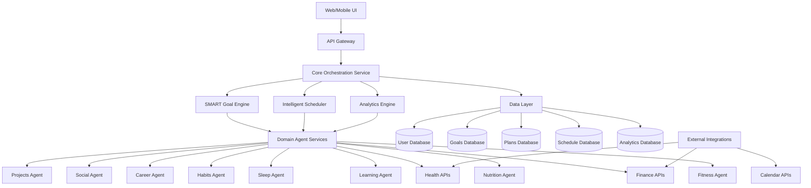

# Design Document

## Overview

The AI Life Assistant is designed as a modular, AI-driven platform that orchestrates multiple life management domains through intelligent agents. The system follows a domain-driven architecture where each life area (fitness, nutrition, finance, etc.) is managed by specialized agents that can collaborate and share context. The core innovation lies in the SMART goal engine that serves as the central orchestrator, ensuring all domain plans align with user objectives and integrate seamlessly with existing schedules.

The platform uses a microservices architecture with a central coordination layer, allowing for independent scaling and development of different life domains while maintaining tight integration through shared data models and event-driven communication.

## Architecture

### High-Level Architecture



### Service Architecture Patterns

**Domain Agent Pattern**: Each life domain is managed by a specialized AI agent that understands domain-specific requirements, constraints, and optimization strategies. Agents communicate through a shared event bus and can request services from other agents.

**Event-Driven Coordination**: Changes in one domain trigger events that other relevant domains can respond to. For example, a new fitness goal triggers events that the nutrition agent uses to adjust meal plans and the scheduler uses to block workout times.

**Intelligent Scheduling Layer**: A centralized scheduler that understands priorities, energy patterns, dependencies, and constraints across all domains to optimize time allocation.

## Components and Interfaces

### Core Orchestration Service

**Responsibilities:**
- Coordinate between domain agents
- Manage cross-domain dependencies and conflicts
- Handle user authentication and authorization
- Route requests to appropriate services
- Maintain system-wide state consistency

**Key Interfaces:**
```typescript
interface CoreOrchestrator {
  createGoal(goal: SMARTGoal): Promise<GoalPlan>
  updateGoal(goalId: string, updates: Partial<SMARTGoal>): Promise<GoalPlan>
  resolveConflicts(conflicts: DomainConflict[]): Promise<Resolution[]>
  getUnifiedDashboard(userId: string): Promise<Dashboard>
}
```

### SMART Goal Engine

**Responsibilities:**
- Guide users through SMART goal creation
- Generate action plans and milestones
- Coordinate with domain agents for implementation
- Track goal progress and suggest adjustments

**Key Interfaces:**
```typescript
interface SMARTGoalEngine {
  validateGoal(goal: GoalInput): ValidationResult
  generateActionPlan(goal: SMARTGoal): Promise<ActionPlan>
  trackProgress(goalId: string): Promise<ProgressReport>
  suggestAdjustments(goalId: string, progress: ProgressData): Promise<Adjustment[]>
}
```

### Domain Agent Services

Each domain agent follows a common interface pattern while implementing domain-specific logic:

```typescript
interface DomainAgent {
  createPlan(goal: DomainGoal, context: UserContext): Promise<DomainPlan>
  updatePlan(planId: string, changes: PlanChange[]): Promise<DomainPlan>
  getScheduleRequirements(planId: string): Promise<ScheduleRequirement[]>
  handleExternalEvent(event: DomainEvent): Promise<void>
  getProgressMetrics(planId: string): Promise<ProgressMetrics>
}
```

**Fitness Agent:**
- Creates workout routines based on goals, fitness level, and available equipment
- Integrates with health data and nutrition plans
- Adjusts intensity based on recovery metrics and schedule constraints

**Nutrition Agent:**
- Generates meal plans aligned with health, fitness, and budget goals
- Creates shopping lists and meal prep schedules
- Monitors nutritional intake and suggests adjustments

**Finance Agent:**
- Creates budgets and savings plans
- Tracks expenses and provides spending alerts
- Calculates costs for other domain plans and suggests optimizations

### Intelligent Scheduler

**Responsibilities:**
- Import and sync external calendars
- Optimize time allocation across all life domains
- Resolve scheduling conflicts intelligently
- Adapt to user behavior patterns and preferences

**Key Features:**
- Energy-based scheduling (high-energy tasks during peak hours)
- Dependency-aware scheduling (prerequisites before dependent tasks)
- Conflict resolution with priority-based suggestions
- Adaptive rescheduling based on completion patterns

### Analytics Engine

**Responsibilities:**
- Track progress across all life domains
- Identify patterns and correlations in user behavior
- Generate insights and optimization suggestions
- Provide predictive analytics for goal achievement

**Key Interfaces:**
```typescript
interface AnalyticsEngine {
  generateInsights(userId: string, timeframe: TimeRange): Promise<Insight[]>
  predictGoalSuccess(goalId: string): Promise<SuccessPrediction>
  identifyBottlenecks(userId: string): Promise<Bottleneck[]>
  suggestOptimizations(userId: string): Promise<Optimization[]>
}
```

## Data Models

### Core Data Models

```typescript
interface SMARTGoal {
  id: string
  userId: string
  title: string
  description: string
  specific: string
  measurable: MeasurableMetric[]
  achievable: AchievabilityAssessment
  relevant: RelevanceContext
  timeBound: TimeConstraint
  status: GoalStatus
  createdAt: Date
  updatedAt: Date
}

interface ActionPlan {
  id: string
  goalId: string
  milestones: Milestone[]
  tasks: Task[]
  dependencies: Dependency[]
  estimatedDuration: Duration
  requiredResources: Resource[]
}

interface DomainPlan {
  id: string
  userId: string
  domain: LifeDomain
  goalIds: string[]
  activities: Activity[]
  scheduleRequirements: ScheduleRequirement[]
  resources: Resource[]
  metrics: Metric[]
  status: PlanStatus
}

interface ScheduleEntry {
  id: string
  userId: string
  title: string
  description: string
  startTime: Date
  endTime: Date
  domain: LifeDomain
  priority: Priority
  flexibility: FlexibilityLevel
  dependencies: string[]
  recurrence?: RecurrencePattern
}
```

### Domain-Specific Models

**Fitness Models:**
```typescript
interface WorkoutPlan {
  exercises: Exercise[]
  duration: number
  intensity: IntensityLevel
  equipment: Equipment[]
  targetMuscleGroups: MuscleGroup[]
}

interface Exercise {
  name: string
  sets: number
  reps: number
  weight?: number
  duration?: number
  restPeriod: number
}
```

**Nutrition Models:**
```typescript
interface MealPlan {
  meals: Meal[]
  totalCalories: number
  macronutrients: MacroBreakdown
  shoppingList: ShoppingItem[]
  prepInstructions: PrepInstruction[]
}

interface Meal {
  name: string
  recipes: Recipe[]
  calories: number
  macros: MacroBreakdown
  prepTime: number
  cookTime: number
}
```

## Error Handling

### Error Categories

**Validation Errors:**
- Invalid SMART goal criteria
- Conflicting domain requirements
- Resource constraint violations
- Schedule impossibilities

**Integration Errors:**
- External calendar sync failures
- Health data import issues
- Financial account connection problems
- Third-party API failures

**Business Logic Errors:**
- Goal-plan misalignment
- Cross-domain conflicts
- Resource over-allocation
- Timeline impossibilities

### Error Handling Strategy

**Graceful Degradation:**
- Continue operation with reduced functionality when external services fail
- Provide manual alternatives when automated planning fails
- Cache critical data to maintain core functionality during outages

**User Communication:**
- Clear, actionable error messages
- Suggested alternatives when plans fail
- Progress preservation during system issues
- Transparent status updates for long-running operations

**Recovery Mechanisms:**
- Automatic retry with exponential backoff for transient failures
- Fallback to cached data when real-time data is unavailable
- Manual override options for automated decisions
- Data consistency checks and repair procedures

## Testing Strategy

### Unit Testing
- Individual domain agent logic
- SMART goal validation and planning algorithms
- Scheduling optimization algorithms
- Data model validation and transformations

### Integration Testing
- Cross-domain agent communication
- External API integrations (calendars, health platforms, financial services)
- Database operations and data consistency
- Event-driven workflows between services

### End-to-End Testing
- Complete goal creation to achievement workflows
- Multi-domain plan coordination scenarios
- Schedule import and conflict resolution
- Progress tracking and analytics generation

### Performance Testing
- Concurrent user load testing
- Large dataset processing (extensive schedules, long-term goals)
- Real-time scheduling optimization under load
- Analytics query performance with historical data

### User Acceptance Testing
- SMART goal creation workflows
- Domain-specific plan generation and modification
- Schedule integration and conflict resolution
- Progress tracking and insight generation
- Mobile and web interface usability

### AI/ML Testing
- Goal plan generation accuracy and relevance
- Schedule optimization effectiveness
- Progress prediction accuracy
- Insight generation quality and actionability
- Agent decision-making consistency and explainability