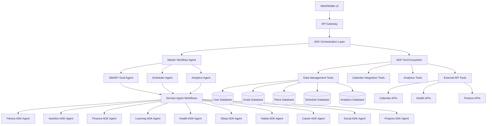

# Design Document

## Overview

The AI Life Assistant is designed as a modular, AI-driven platform built on Google's Agent Development Kit (ADK) that orchestrates multiple life management domains through intelligent agents. The system leverages ADK's multi-agent architecture where each life area (fitness, nutrition, finance, etc.) is managed by specialized ADK agents that can collaborate and share context through ADK's flexible orchestration patterns. The core innovation lies in the SMART goal engine that serves as the central orchestrator, ensuring all domain plans align with user objectives and integrate seamlessly with existing schedules.

The platform uses ADK's model-agnostic framework with Sequential, Parallel, and Loop workflow agents for predictable pipelines, while leveraging LLM-driven dynamic routing for adaptive behavior. This enables independent scaling and development of different life domains while maintaining tight integration through ADK's rich tool ecosystem and agent communication patterns.

## Architecture

### High-Level Architecture



### ADK Architecture Patterns

**Multi-Agent Orchestration**: Each life domain is managed by a specialized ADK agent that understands domain-specific requirements, constraints, and optimization strategies. Agents communicate through ADK's agent transfer mechanisms and can delegate tasks to other agents in the hierarchy.

**Workflow-Driven Coordination**: Changes in one domain trigger ADK workflow patterns (Sequential, Parallel, Loop) that coordinate responses across relevant domains. For example, a new fitness goal triggers a Sequential workflow that coordinates nutrition agent meal plan adjustments and scheduler agent workout time blocking.

**ADK Tool Integration**: Agents leverage ADK's rich tool ecosystem including custom functions, third-party integrations, and other agents as tools. This enables flexible capability extension and seamless integration with external services.

**Intelligent Agent Scheduling**: A centralized ADK scheduler agent that uses Sequential and Parallel workflows to understand priorities, energy patterns, dependencies, and constraints across all domains to optimize time allocation.

## Components and Interfaces

### ADK Master Workflow Agent

**Responsibilities:**
- Orchestrate ADK agent workflows across domains
- Manage cross-domain dependencies and conflicts using ADK coordination patterns
- Handle user authentication and authorization through ADK tools
- Route requests to appropriate ADK agents using dynamic routing
- Maintain system-wide state consistency through ADK agent communication

**ADK Implementation:**
```typescript
interface MasterWorkflowAgent extends ADKAgent {
  createGoalWorkflow(goal: SMARTGoal): Promise<WorkflowResult>
  updateGoalWorkflow(goalId: string, updates: Partial<SMARTGoal>): Promise<WorkflowResult>
  resolveConflictsWorkflow(conflicts: DomainConflict[]): Promise<WorkflowResult>
  getDashboardWorkflow(userId: string): Promise<WorkflowResult>
  
  // ADK-specific methods
  transferToAgent(targetAgent: string, context: AgentContext): Promise<AgentTransferResult>
  executeSequentialWorkflow(agents: ADKAgent[], context: WorkflowContext): Promise<WorkflowResult>
  executeParallelWorkflow(agents: ADKAgent[], context: WorkflowContext): Promise<WorkflowResult>
}
```

### SMART Goal ADK Agent

**Responsibilities:**
- Guide users through SMART goal creation using ADK tools
- Generate action plans and milestones through agent workflows
- Coordinate with domain ADK agents for implementation using agent transfer
- Track goal progress and suggest adjustments through Sequential workflows

**ADK Implementation:**
```typescript
interface SMARTGoalAgent extends ADKAgent {
  validateGoalTool(goal: GoalInput): Promise<ValidationResult>
  generateActionPlanWorkflow(goal: SMARTGoal): Promise<ActionPlan>
  trackProgressWorkflow(goalId: string): Promise<ProgressReport>
  suggestAdjustmentsWorkflow(goalId: string, progress: ProgressData): Promise<Adjustment[]>
  
  // ADK workflow methods
  coordinateWithDomainAgents(goal: SMARTGoal): Promise<DomainCoordinationResult>
  executeGoalCreationSequence(goalInput: GoalInput): Promise<GoalCreationResult>
  monitorGoalProgressLoop(goalId: string): Promise<ProgressMonitoringResult>
}
```

### Domain ADK Agents

Each domain ADK agent follows a common interface pattern while implementing domain-specific logic using ADK tools and workflows:

```typescript
interface DomainADKAgent extends ADKAgent {
  createPlanWorkflow(goal: DomainGoal, context: UserContext): Promise<DomainPlan>
  updatePlanWorkflow(planId: string, changes: PlanChange[]): Promise<DomainPlan>
  getScheduleRequirementsWorkflow(planId: string): Promise<ScheduleRequirement[]>
  handleExternalEventWorkflow(event: DomainEvent): Promise<void>
  getProgressMetricsWorkflow(planId: string): Promise<ProgressMetrics>
  
  // ADK-specific methods
  useDomainTools(toolName: string, parameters: ToolParameters): Promise<ToolResult>
  coordinateWithOtherDomains(domains: string[], context: CoordinationContext): Promise<CoordinationResult>
  executeAdaptiveWorkflow(workflowType: WorkflowType, context: WorkflowContext): Promise<WorkflowResult>
}
```

**Fitness ADK Agent:**
- Creates workout routines using ADK tools for fitness planning and equipment assessment
- Integrates with health data through ADK external API tools and coordinates with nutrition agent via agent transfer
- Adjusts intensity using Sequential workflows that analyze recovery metrics and schedule constraints

**Nutrition ADK Agent:**
- Generates meal plans using ADK tools that integrate health, fitness, and budget data from other agents
- Creates shopping lists and meal prep schedules through Parallel workflows
- Monitors nutritional intake using Loop workflows and suggests adjustments via agent coordination

**Finance ADK Agent:**
- Creates budgets and savings plans using ADK financial planning tools
- Tracks expenses through external API integrations and provides spending alerts via ADK notification tools
- Calculates costs for other domain plans using agent communication and suggests optimizations through Sequential workflows

### Intelligent Scheduler ADK Agent

**Responsibilities:**
- Import and sync external calendars using ADK external API tools
- Optimize time allocation across all life domains through Parallel agent coordination
- Resolve scheduling conflicts intelligently using Sequential conflict resolution workflows
- Adapt to user behavior patterns and preferences through Loop-based learning workflows

**ADK Implementation Features:**
- Energy-based scheduling using ADK tools for user pattern analysis
- Dependency-aware scheduling through Sequential workflow orchestration
- Conflict resolution using agent transfer to domain experts for priority assessment
- Adaptive rescheduling through Loop workflows that learn from completion patterns

### Analytics ADK Agent

**Responsibilities:**
- Track progress across all life domains using Parallel data collection workflows
- Identify patterns and correlations through ADK analytics tools and ML integrations
- Generate insights and optimization suggestions via Sequential analysis workflows
- Provide predictive analytics using ADK's model-agnostic ML capabilities

**ADK Implementation:**
```typescript
interface AnalyticsADKAgent extends ADKAgent {
  generateInsightsWorkflow(userId: string, timeframe: TimeRange): Promise<Insight[]>
  predictGoalSuccessWorkflow(goalId: string): Promise<SuccessPrediction>
  identifyBottlenecksWorkflow(userId: string): Promise<Bottleneck[]>
  suggestOptimizationsWorkflow(userId: string): Promise<Optimization[]>
  
  // ADK-specific analytics methods
  collectDataFromAllDomains(userId: string): Promise<DomainDataCollection>
  executeAnalyticsToolchain(data: AnalyticsData): Promise<AnalyticsResult>
  coordinateWithDomainAgentsForInsights(insights: Insight[]): Promise<CoordinatedInsights>
}
```

## Data Models

### Core Data Models

```typescript
interface SMARTGoal {
  id: string
  userId: string
  title: string
  description: string
  specific: string
  measurable: MeasurableMetric[]
  achievable: AchievabilityAssessment
  relevant: RelevanceContext
  timeBound: TimeConstraint
  status: GoalStatus
  createdAt: Date
  updatedAt: Date
}

interface ActionPlan {
  id: string
  goalId: string
  milestones: Milestone[]
  tasks: Task[]
  dependencies: Dependency[]
  estimatedDuration: Duration
  requiredResources: Resource[]
}

interface DomainPlan {
  id: string
  userId: string
  domain: LifeDomain
  goalIds: string[]
  activities: Activity[]
  scheduleRequirements: ScheduleRequirement[]
  resources: Resource[]
  metrics: Metric[]
  status: PlanStatus
}

interface ScheduleEntry {
  id: string
  userId: string
  title: string
  description: string
  startTime: Date
  endTime: Date
  domain: LifeDomain
  priority: Priority
  flexibility: FlexibilityLevel
  dependencies: string[]
  recurrence?: RecurrencePattern
}
```

### Domain-Specific Models

**Fitness Models:**
```typescript
interface WorkoutPlan {
  exercises: Exercise[]
  duration: number
  intensity: IntensityLevel
  equipment: Equipment[]
  targetMuscleGroups: MuscleGroup[]
}

interface Exercise {
  name: string
  sets: number
  reps: number
  weight?: number
  duration?: number
  restPeriod: number
}
```

**Nutrition Models:**
```typescript
interface MealPlan {
  meals: Meal[]
  totalCalories: number
  macronutrients: MacroBreakdown
  shoppingList: ShoppingItem[]
  prepInstructions: PrepInstruction[]
}

interface Meal {
  name: string
  recipes: Recipe[]
  calories: number
  macros: MacroBreakdown
  prepTime: number
  cookTime: number
}
```

## Error Handling

### Error Categories

**Validation Errors:**
- Invalid SMART goal criteria
- Conflicting domain requirements
- Resource constraint violations
- Schedule impossibilities

**Integration Errors:**
- External calendar sync failures
- Health data import issues
- Financial account connection problems
- Third-party API failures

**Business Logic Errors:**
- Goal-plan misalignment
- Cross-domain conflicts
- Resource over-allocation
- Timeline impossibilities

### Error Handling Strategy

**Graceful Degradation:**
- Continue operation with reduced functionality when external services fail
- Provide manual alternatives when automated planning fails
- Cache critical data to maintain core functionality during outages

**User Communication:**
- Clear, actionable error messages
- Suggested alternatives when plans fail
- Progress preservation during system issues
- Transparent status updates for long-running operations

**Recovery Mechanisms:**
- Automatic retry with exponential backoff for transient failures
- Fallback to cached data when real-time data is unavailable
- Manual override options for automated decisions
- Data consistency checks and repair procedures

## Testing Strategy

### Unit Testing
- Individual domain agent logic
- SMART goal validation and planning algorithms
- Scheduling optimization algorithms
- Data model validation and transformations

### Integration Testing
- Cross-domain agent communication
- External API integrations (calendars, health platforms, financial services)
- Database operations and data consistency
- Event-driven workflows between services

### End-to-End Testing
- Complete goal creation to achievement workflows
- Multi-domain plan coordination scenarios
- Schedule import and conflict resolution
- Progress tracking and analytics generation

### Performance Testing
- Concurrent user load testing
- Large dataset processing (extensive schedules, long-term goals)
- Real-time scheduling optimization under load
- Analytics query performance with historical data

### User Acceptance Testing
- SMART goal creation workflows
- Domain-specific plan generation and modification
- Schedule integration and conflict resolution
- Progress tracking and insight generation
- Mobile and web interface usability

### AI/ML Testing
- Goal plan generation accuracy and relevance
- Schedule optimization effectiveness
- Progress prediction accuracy
- Insight generation quality and actionability
- Agent decision-making consistency and explainability